# Balaxy (nom provisoire - sortie publique fin Avril) 

Interface web pour `ansible-playbook`, afin de mieux suivre l'exécution des playbooks :

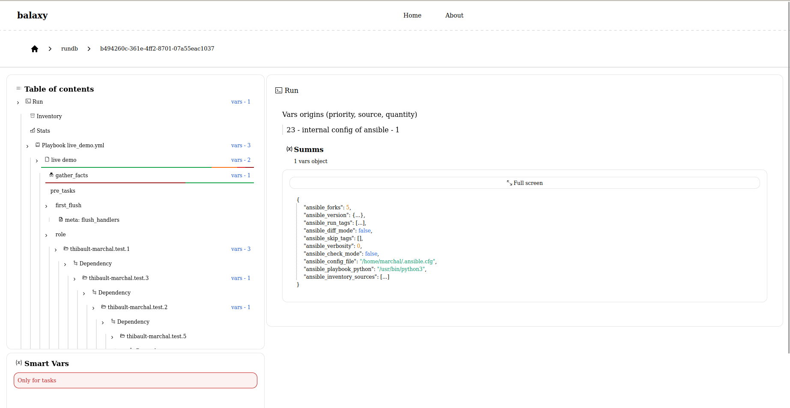

# Mise en place simple

Il suffit d’ajouter une collection contenant un callback plugin, puis d'ajouter deux lignes dans votre fichier de configuration ~/.ansible.cfg :

```bash
callback_plugins=/path/to/newly/installed/collections/callback_plugin/plugins/callback/balaxy 

stdout_callback=callbackName
```

Ensuite, exécutez vos playbooks Ansible normalement :

```bash
ansible-playbook -i ../test.inventory2.ini -i test.inventory3.ini live_demo.yml
```


Le plugin intercepte les événements générés par Ansible :

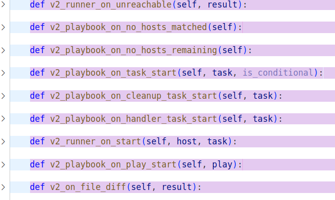 
(https://github.com/ansible/ansible/blob/devel/lib/ansible/plugins/callback/__init__.py)

Les interprète, puis envoie à un serveur distant :


# Fonctionnalités existantes

## Centralisation des exécutions `ansible-playbook`

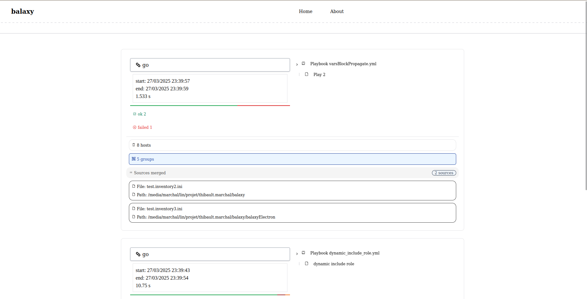

## Affichage des tâches selon la hiérarchie d’origine :

*playbook → play → rôle → block → include / import…*

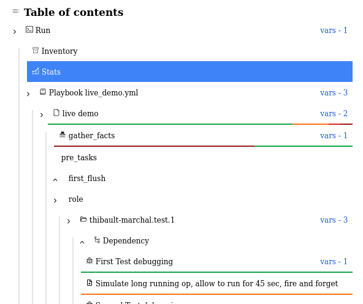

## Visualisation des rôles importés et de leurs dépendances :

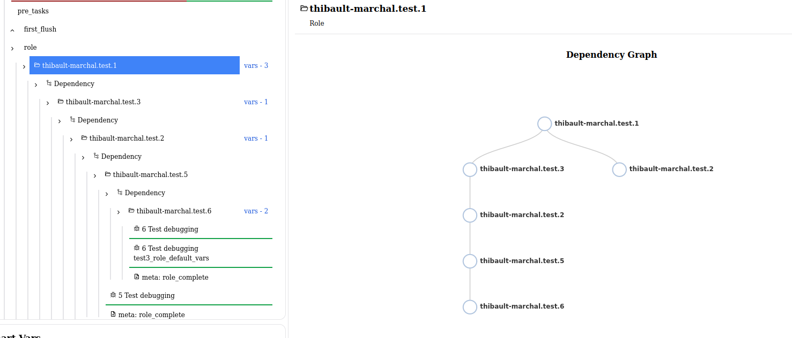

## Représentation des `include` / `import` :


## Représentation des `block` :


## Le rendu classique toujours disponible dans le terminal :

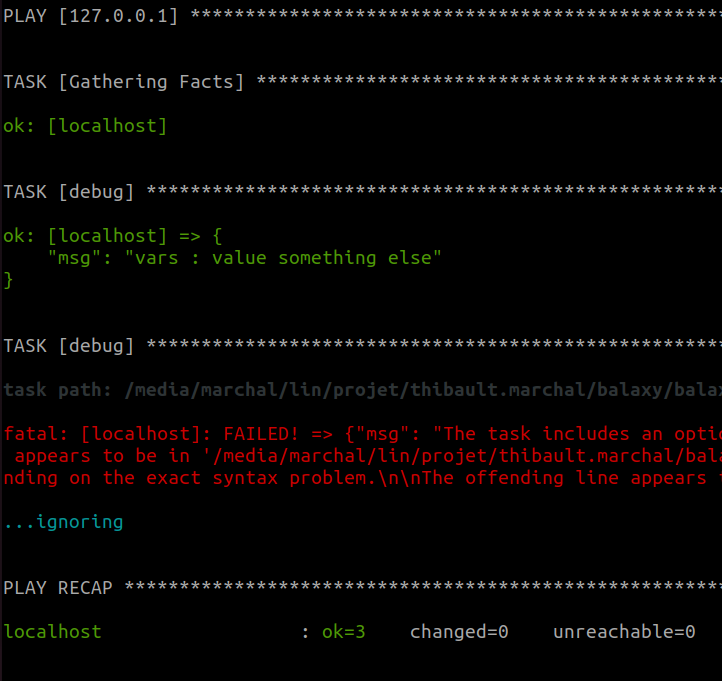

## Vue de l'inventaire Ansible :


## Correspondance entre hôtes et les cibles des plays :

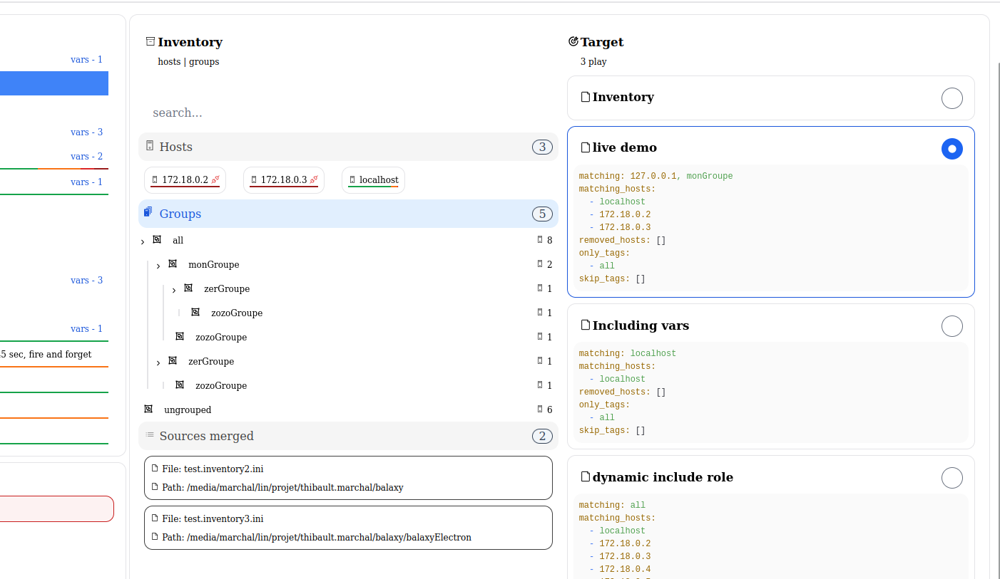

## Codes visuels pour représenter l’état des hôtes (ok, changed, failed, unreachable…) :
    
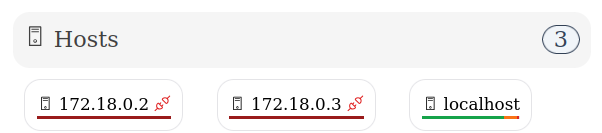

## Hiérarchie des groupes dans l’inventaire :

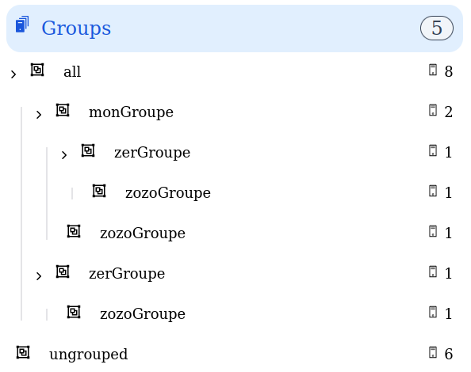

# Variables 

## Suivi des variables et de leurs points d’entrée :


## Origine des variables (fichier, script, groupe…) :


# Statistiques & Résultats

## Statistiques globales de la run :


## Vue par tâche et par hôte :


## Hôtes groupés par résultat :


## (prochainement) Affichage spécifique selon le module (ex. gather_facts) :


Plutôt que :


## Timeline par hôte :


# Documentation intégrée

## Sur les actions des tâches :


## Sur les variables :

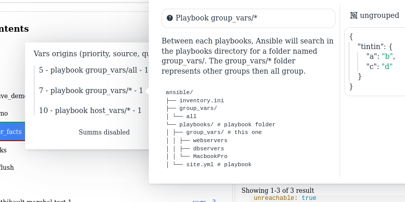

# Smart Vars Panel

Un panneau intelligent qui regroupe toutes les variables actives à un moment donné, par hôte :

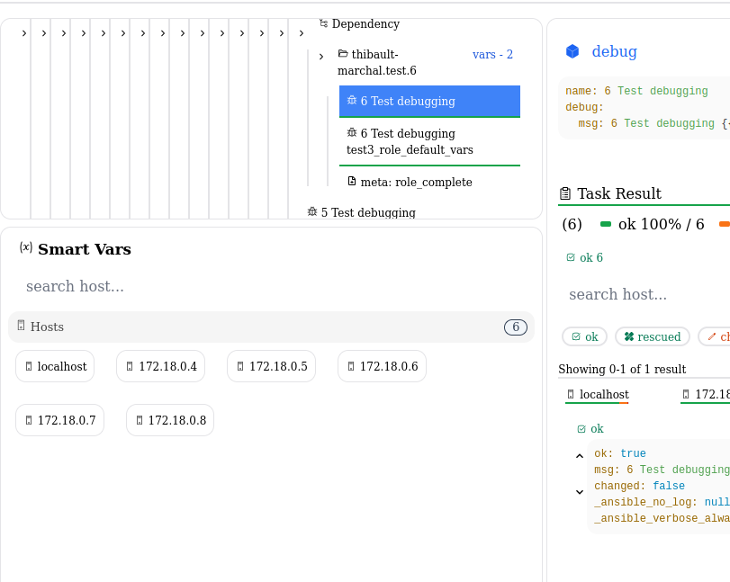

***Sélectionner un hôte***

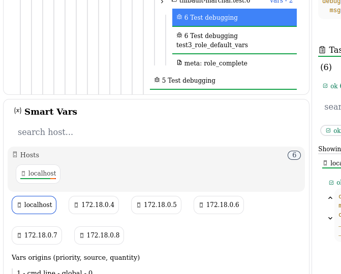

## Variables par origine (priorité, portée, source...) :

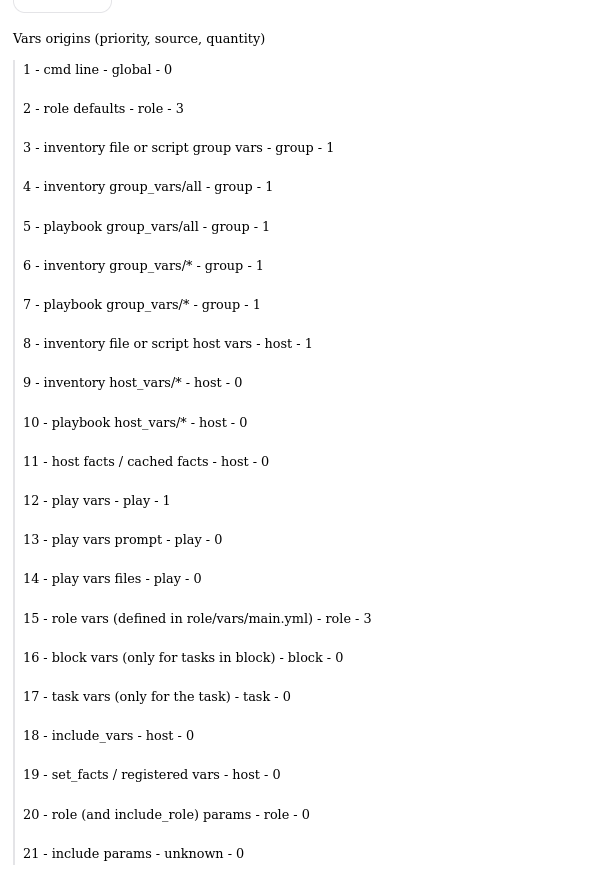

Chaque élément est cliquable pour afficher sa documentation et son origine directe (hôte, groupe, tâche, play…) :


## Addition finale des variables (ordre de priorité respecté) :


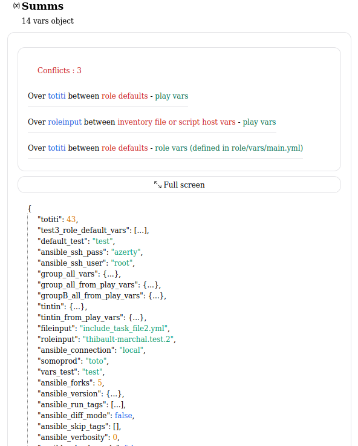

## Accès rapide aux conflits détectés :

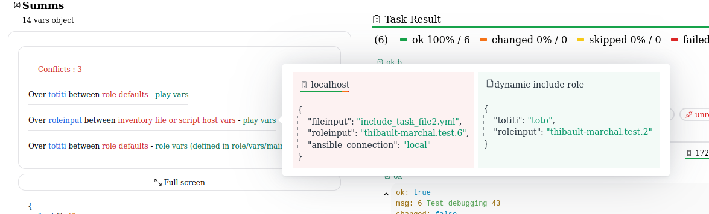
 
# Limitations

Les limitations actuelles proviennent principalement du plugin Python, notamment sur la manière de capter certaines informations ou de gérer certains cas.

## `ansible-playbook` + `inventory` + `playbooks`

La solution est conçue pour être utilisée avec la commande ansible-playbook, un ou plusieurs fichiers d’inventaire, et **un seul** playbook en paramètre. L'interface **ne fonctionne pas** dans les cas suivants :
- Inventaire dynamique ❌
- Utilisation de la commande ansible (au lieu de ansible-playbook) ❌

## Un seul playbook en argument

Il ne faut passer **qu’un seul** playbook dans la commande. Les `import_playbook` sont gérés à l’intérieur, mais plusieurs fichiers `.yml` en arguments ne sont pas supportés.

❌ Mauvais :
```
ansible-playbook live_demo.yml another_one.yml
```

✅ Correct :
```
ansible-playbook live_demo.yml
```

## Variables contenant des expressions Jinja2

Les variables définies à l’aide de Jinja2 (ex: {{ some_var }}) ne sont pas encore correctement interprétées par le plugin.
Cela **n’impacte pas l’exécution**, mais ces variables peuvent être absentes ou mal affichées dans l’interface.

## Propriétés de scope (connection, sudo, etc.)

Le bon traitement des propriétés de connexion, d’environnement ou d’élévation (sudo) dépend aussi de la capacité à interpréter Jinja2.
En attendant une solution, des **indications visuelles** sont fournies via la table des matières :

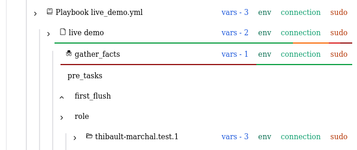

## Tags

Les tags sont bien enregistrés, mais pas encore affichés et non valorisés dans l'interface.

## Bugs possibles

Le plugin et l’application sont en phase **pré-alpha** :

- Non destinés à un usage en production
- Informations envoyées au serveur sans anonymisation, ce qui peut inclure IP, méthodes d’accès, mots de passe, clés SSH, et

## Rafraîchissement non dynamique

L’interface **n’est pas dynamique** : il faut rafraîchir manuellement la page pour voir les nouvelles informations, ou attendre la fin de l’exécution.

# Conclusion

Plusieurs pistes sont envisagées pour l’avenir de l’outil :
- Meilleur support des attributs cumulatifs (`connection`, `sudo`, `environment`, etc.)
- Une page "explorer" pour :
    - Naviguer dans les entités
    - Accéder à la documentation des modules 
    - Lister les résultats par module sur l’ensemble des runs
    - Trouver toutes les tâches avec un attribut donné (when, changed_when, etc.)
- Segmentation public / privé avec authentification.
- Fonctionnalités collaboratives :
    - Serveur IRC intégré avec salons : 
        - Global
        - Par run
        - Etc...
    - Vignetes collables (info, attention, danger) dans la table des matières.
    - Espace commentaires :
        - Par module
        - Par résultat
        - Par tâche
        - Par run
        - Etc...
- Rendu dynamique en temps réel.
- Des notifications quand une run commence ou se termine.
- L'ajout d'autre plugin *(inventaire / Cache)* à la collection et intégré à l'interface.
- Et plus encore selon les besoins et retours
