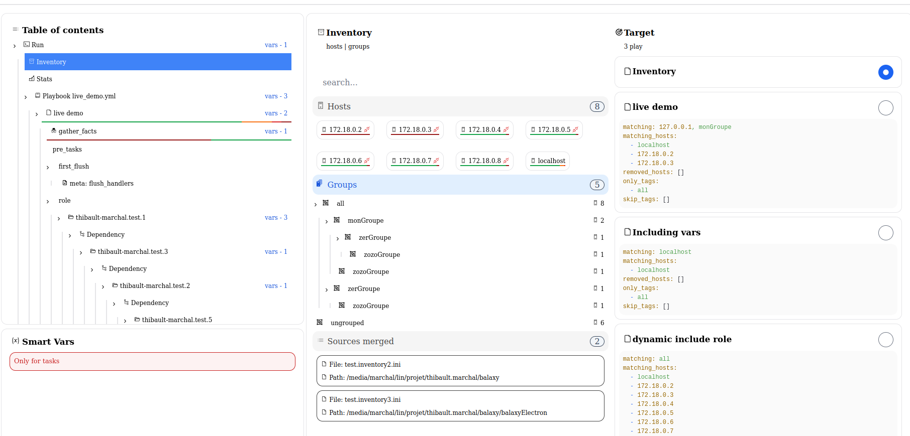

# Balaxy (product name not yet chosen - public release end of April)

Web interface over `ansible-playbook` to better visualize and track runs:


# Easy to set up

Just add a collection containing a callback plugin, and include two lines in your `~/.ansible.cfg`:

```bash
callback_plugins=/path/to/newly/installed/collections/callback_plugin/plugins/callback/balaxy 

stdout_callback=callbackName
```

Then, run your playbooks as usual:
```bash
ansible-playbook -i ../test.inventory2.ini -i test.inventory3.ini live_demo.yml
```


The plugin uses events emitted by Ansible:

 
(https://github.com/ansible/ansible/blob/devel/lib/ansible/plugins/callback/__init__.py)

These events are parsed and sent to the server:


# Current Features

## Centralized `ansible-playbook` runs


## Task display in original hierarchy

*playbook → play → rôle → block → include / import…*


## Imported roles and their dependency graph


## Includes and imports representation


## Block representation


## Default terminal output still available


## Ansible inventory overview



## Host-to-target matching in selected plays


## Visual status codes for hosts (ok, changed, failed, unreachable, etc.)


## Group hierarchy in inventory


# Variables 

## Track variables and their entry points


## Sources of variables (inventory file, group script, etc.)


# Stats & Results

## Global run statistics


## Task-level and host-level view


## Hosts grouped by result


## (soon) Module-specific rendering (ex. gather_facts) :


Instead of:


## Execution timeline by host


# Built-in Documentation

## On task actions


## On variables


# Smart Vars Panel
A smart panel that shows all active variables at any task, by host:


***Selecting a host***


## Variables by source (priority, scope, origin...)


Each item is clickable, showing documentation and direct source (host, group, task, play...)


## Final merged variables (according to precedence)


## Quick access to detected conflicts


 
# Limitations

Current limitations mostly come from the Python callback plugin, and how it captures or processes some Ansible features.

## `ansible-playbook` + `inventory` + `playbooks`

This solution is designed to work only with the `ansible-playbook` command, with one or more inventory files and **a single** playbook argument.

The interface **won’t work** with:
- Dynamic inventory ❌
- The ansible command (instead of ansible-playbook) ❌

## One playbook argument only

You must pass **only one** playbook file in the command line. `import_playbook` inside the YAML is supported, but multiple CLI arguments are not.

❌ Not supported :
```
ansible-playbook live_demo.yml another_one.yml
```

✅ Supported :
```
ansible-playbook live_demo.yml
```

## Variables using Jinja2 expressions

Currently, variables defined with Jinja2 expressions (e.g. {{ some_var }}) are not reliably resolved by the plugin.

This does **not** affect the playbook execution itself, but those variables may appear **missing or incorrect** in the web interface.

## Scope properties (connection, sudo, etc.)

Properties such as `connection` method, `sudo`, `environment` vars, etc. may not be properly recorded yet.
Until Jinja2 resolution is supported, only **visual hints** are provided in the Table of Contents:


## Tags

Tags are stored, but **not yet displayed** or used in the UI.

## Potential bugs
The plugin and web app are in **pre-alpha stage**:
- Not intended for production use
- Information sent to the server is **not sanitized**, and may include private data such as IP addresses, access methods, passwords, SSH keys, etc.

## Static interface

The interface is **not live-updating**: you need to refresh the page manually or wait for the run to finish.

# Conclusion

Here are some upcoming ideas and improvements being considered: 
- Support for additional scope attributes (`connection`, `sudo`, `environment`, etc.)
- An "Explorer" page to browse:
    - Browsing entities
    - Modules and their documentation
    - Module results across all runs
    - Tasks filtered by attributes (when, changed_when, etc.)
- Public/private segmentation with authentication.
- Collaboration features:
    - Built-in IRC server with channels: 
        - Global
        - Per run
        - Others to be defined
    - Sticky notes or badges in the Table of Contents (info, warning, danger)
    - Comment section:
        - Per module
        - Per résultat
        - Per tâche
        - Per run
        - Etc...
- Real-time dynamic interface
- Notifications when a run begins or ends
- Support for more plugins (inventory, cache, etc.) integrated into the interface
- And more, based on feedback and needs
